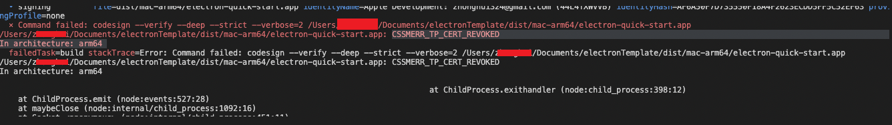
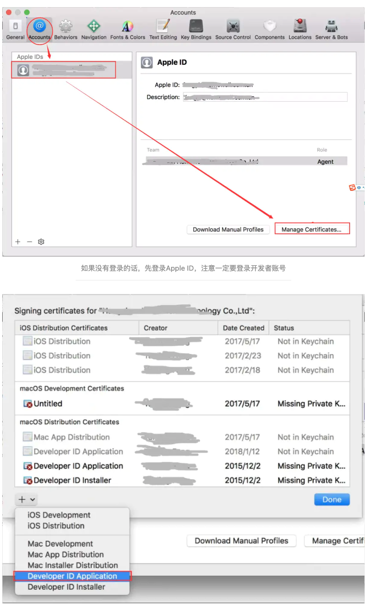
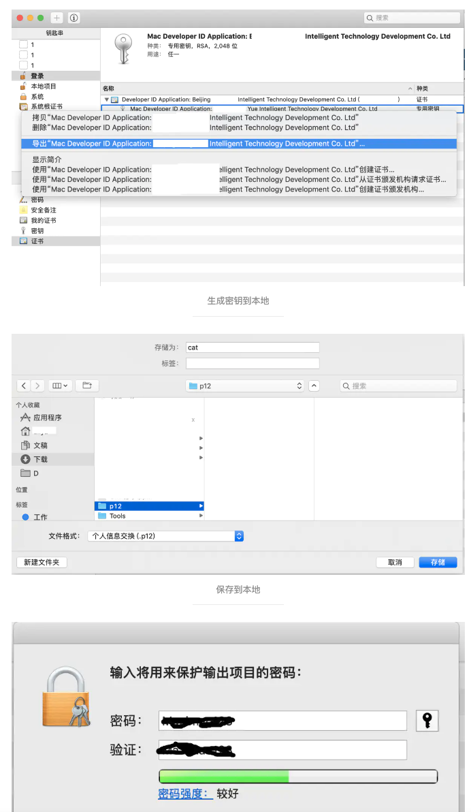
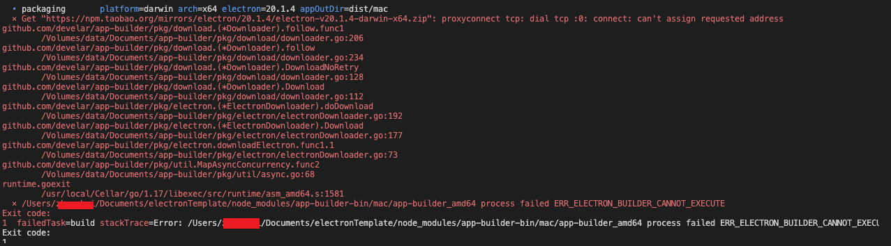

### Q： rollup-plugin-typescript2 报错 （

> Cannot read properties of undefined done

### A 修改 rollup.config.js 文件

```js
plugins: [
  json(),
  typescript({
    tsconfig: path.resolve(__dirname, 'tsconfig.json'),
  })
]
```

再将 tsconfig.json 文件中的 module 配置修改成 es2020

### Q :签名问题



### A: 创建证书并添加到环境变量中

在 xcode 中创建证书




我在创建证书是在第一张图的步骤生成的就是 p12 证书，然后开始添加环境变量

```shell
sudo vim ~/.bash_profile
```

```shell
export CSC_LINK=/Users/.../cat.p12  // 那会密钥保存的位置
export CSC_KEY_PASSWORD=xxxx  // 那会设置的密钥密码
```

```shell
source ~/.bash_profile
env
> // 输出本地所有环境变量，看到有CSC_LINK和CSC_KEY_PASSWORD就设置成功
```

有时候存在终端重启之后需要重新执行 source ~/.bash_profile 让环境变量生效

### Q： electron 下载失败



下载对应连接的文件，放在缓存目录， 不同操作系统缓存目录

- mac ： ~/Library/Caches/electron
- windows: /user/AppData/local/electron
